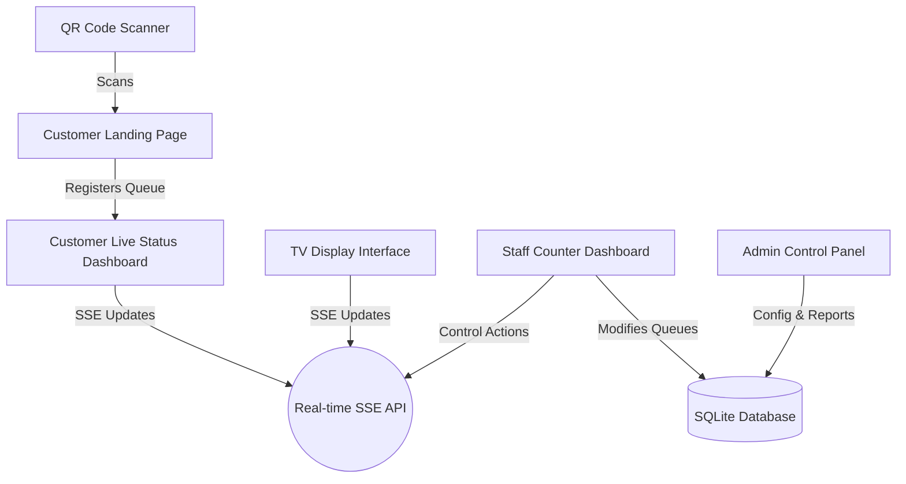

# Smart Queue System - Implementation Plan

The Smart Queue System is a premium, contactless queue management web application. It enables customers to scan a QR code (static or daily) to receive a queue token, track their status in real-time on their mobile phones, and allows staff to manage queues from a counter dashboard. It also features a gorgeous TV Display Interface with visual flashing and audio queue announcements.

## System Architecture & Tech Stack

To ensure extreme ease of setup and robust local execution, we will build a unified full-stack **Next.js App Router** application inside the `d:\project\SmartQR\Prototype` workspace:

1. **Frontend**: Next.js 15 (React 19) styled with a custom **Vanilla CSS** design system. We will not use Tailwind CSS to follow the vanilla design guidelines. We will create a rich, premium visual design featuring sleek dark mode, deep glassmorphism (translucency, blur, borders), harmonious HSL colors, and micro-interactions.
2. **Backend**: Next.js API Routes (Route Handlers) handling queue state, token validation, and analytics.
3. **Database**: **SQLite** managed via **Prisma ORM**. This provides a production-grade relational database locally without requiring external PostgreSQL setup, matching the database requirement while ensuring instant "plug-and-play" execution.
4. **Real-time Engine**: **Server-Sent Events (SSE)**. Next.js natively supports streaming SSE endpoints (`/api/queue/stream`), which allows the TV Display, Counter Dashboard, and Customer Live Tracking pages to receive instant queue updates without the overhead and ports of a separate WebSocket server.
5. **Audio Announcements**: HTML5 **Web Speech API** + Audio Synthesis for immediate, high-fidelity vocal calling (e.g. *"Queue A001 at Counter 1"*) accompanied by a custom melodic announcement chime.

---

## Database Schema (Prisma)

We will define the following models in `prisma/schema.prisma`:

```prisma
datasource db {
  provider = "sqlite"
  url      = "file:./dev.db"
}

generator client {
  provider = "prisma-client-name" // prisma-client-js
}

model ServiceType {
  id          String   @id @default(uuid())
  name        String   // Lao & English (e.g., "General / ບໍລິການທົ່ວໄປ")
  prefix      String   // e.g. "A", "B", "C"
  priority    Int      @default(1) // Higher = more priority
  queues      Queue[]
  createdAt   DateTime @default(now())
}

model Counter {
  id        String   @id // e.g. "1", "2", "3"
  name      String   // e.g. "Counter 1"
  status    String   // "ACTIVE", "INACTIVE"
  queues    Queue[]
}

model Queue {
  id            String      @id @default(uuid())
  queueNumber   String      // e.g. "A001", "B012"
  customerName  String
  customerPhone String
  serviceTypeId String
  serviceType   ServiceType @relation(fields: [serviceTypeId], references: [id])
  status        String      // "WAITING", "CALLING", "COMPLETED", "SKIPPED"
  counterId     String?
  counter       Counter?    @relation(fields: [counterId], references: [id])
  createdAt     DateTime    @default(now())
  calledAt      DateTime?
  completedAt   DateTime?
}

model SystemSettings {
  id           String    @id @default("config")
  qrType       String    @default("STATIC") // "STATIC" or "DAILY"
  dailyToken   String    @default("static-secret-key")
  tokenDate    String?   // "YYYY-MM-DD"
}

model User {
  id       String @id @default(uuid())
  username String @unique
  password String // Hashed
  role     String // "ADMIN" or "STAFF"
}
```

---

## User Interface Design

The application will feature 5 major functional views, each crafted with a gorgeous, dark/glassmorphic responsive theme:



### 1. Customer Landing Page (`/customer/register`)
- **Visuals**: A clean, mobile-first card with high-quality fonts, subtle gradients, and elegant form inputs.
- **Features**:
  - Auto-selects active branch/service types.
  - Generates token with name & phone.
  - Protects against off-site bookings by validating the daily security token in the URL.

### 2. Customer Live Status Dashboard (`/customer/status/[id]`)
- **Visuals**: Large glowing current number indicator, progress bar, estimated wait time badge, and animated cards of queues ahead of them.
- **Features**:
  - Live updates via SSE stream.
  - Detailed queue sequence: "You are number X in line".
  - Audio/vibration alert when queue state transitions to `CALLING`.

### 3. Staff Counter Dashboard (`/staff/counter`)
- **Visuals**: A double-column command center. Left: Counter selector, active queue display, stats cards (Total Waiting, Served, Skipped). Right: Queue list with tabs (Waiting, Served, Skipped).
- **Features**:
  - Counter selection dropdown (locks to local storage).
  - High-visibility action buttons: **Call Next**, **Recall** (re-trigger TV announcement), **Skip**, **Complete**.
  - Custom priority selection (e.g. can select to service VIP first).

### 4. TV Display Interface (`/tv`)
- **Visuals**: An ultra-premium, dark-themed dashboard optimized for large TV screens.
  - Left column: "NOW SERVING" with large glowing grid cards (Counter X: Queue Y).
  - Right column: "UPCOMING QUEUES" running down the screen.
- **Features**:
  - Flashing screen borders and modal pop-up when a counter calls a new queue.
  - **Audio Announcements**: Synthesized speech voice accompanied by an elegant audio chime using standard HTML5 Audio.

### 5. Admin Control Panel (`/admin`)
- **Visuals**: Sidebar layout with glass components. Tabbed views for:
  - **Overview / Dashboard**: Live charts showing queue volumes, average waiting times.
  - **Queue Categories**: Create/edit service types, set prefix, adjust priorities.
  - **Counters**: Activate or deactivate counter terminals.
  - **QR Configuration**: Toggle Static/Daily QR codes. Displays active QR code with a download button.
  - **Reports & Analytics**: Historical service reports with charts (serviced, skipped, wait times).

---

## User Review Required

> [!IMPORTANT]
> **Use of SQLite instead of PostgreSQL**: To facilitate frictionless, zero-configuration local execution of this prototype, we are using **SQLite** as the default storage engine. It runs inside a local file (`dev.db`) in the project directory, so you do not need to install or configure a PostgreSQL server. We will ensure the database is fully abstracted via Prisma, making it trivial to switch the datasource provider to `postgresql` when transitioning to a production environment.
>
> **Server-Sent Events (SSE) for Real-Time**: Next.js App Router supports streaming HTTP responses natively. Using SSE is standard, lightweight, and robust, removing the need for a separate custom Node.js server. We will use SSE instead of Socket.io for maximum portability, but will implement a clean architecture that can easily be migrated to Socket.io if required.

---

## Open Questions

> [!NOTE]
> 1. **Default Login Credentials**: Do you have a preferred default username/password for the Admin and Staff users? We plan to pre-seed:
>    - Admin: `admin` / `admin123`
>    - Staff: `staff1` / `staff123`
> 2. **Lao Language Audio**: For the TV announcement, since native Lao Text-To-Speech is not pre-installed on standard Operating Systems (like Windows/macOS), would you like the TV to speak in English (e.g., *"Queue A zero zero one at Counter one"*) or would you prefer a melodious ding-dong chime instead? We plan to implement both: an elegant chime followed by the English speech call, which ensures universal compatibility and a premium experience.

---

## Proposed Changes

We will create a brand new Next.js project. The files created and modified are as follows:

### [NEW] Smart Queue Web Application

#### [NEW] [package.json](file:///d:/project/SmartQR/Prototype/package.json)
- Standard Next.js script declarations and dependencies: `next`, `react`, `react-dom`, `@prisma/client`, `lucide-react`, `chart.js`, `react-chartjs-2`.
- DevDependencies: `prisma`, `eslint`.

#### [NEW] [prisma/schema.prisma](file:///d:/project/SmartQR/Prototype/prisma/schema.prisma)
- Prisma DB configuration and models for Queues, Counters, ServiceTypes, settings, and users.

#### [NEW] [src/app/globals.css](file:///d:/project/SmartQR/Prototype/src/app/globals.css)
- Our core **Vanilla CSS Design System**. Features variables for harmonious HSL colors (primary teal, background dark onyx, slate glass, accent gold), sleek CSS resets, smooth transitions, keyframe animations for flashing effects, and reusable utilities.

#### [NEW] [src/app/layout.js](file:///d:/project/SmartQR/Prototype/src/app/layout.js)
- Global layout, injecting custom typography (Google Font `Inter` or `Outfit`) and setting up SEO meta tags and titles.

#### [NEW] [src/lib/db.js](file:///d:/project/SmartQR/Prototype/src/lib/db.js)
- Shared Prisma client connection singleton.

#### [NEW] [src/app/api/setup/route.js](file:///d:/project/SmartQR/Prototype/src/app/api/setup/route.js)
- Direct seeding API to easily initialize database tables, default categories, counters, and admin accounts with one click.

#### [NEW] [src/app/api/queue/route.js](file:///d:/project/SmartQR/Prototype/src/app/api/queue/route.js)
- General API for fetching active queues and registration of new queue tokens.

#### [NEW] [src/app/api/queue/stream/route.js](file:///d:/project/SmartQR/Prototype/src/app/api/queue/stream/route.js)
- SSE route handler streaming real-time queue states to customers, staff, and TV displays.

#### [NEW] [src/app/api/counter/route.js](file:///d:/project/SmartQR/Prototype/src/app/api/counter/route.js)
- Actions for staff counter dashboard: call, recall, complete, and skip.

#### [NEW] [src/app/api/admin/route.js](file:///d:/project/SmartQR/Prototype/src/app/api/admin/route.js)
- APIs for setting adjustments (Daily/Static QR configuration), custom category creation, and analytics queries.

#### [NEW] [src/app/customer/register/page.js](file:///d:/project/SmartQR/Prototype/src/app/customer/register/page.js)
- Mobile-responsive queue registration landing page.

#### [NEW] [src/app/customer/status/[id]/page.js](file:///d:/project/SmartQR/Prototype/src/app/customer/status/%5Bid%5D/page.js)
- Real-time client status display (tracking wait time, queues ahead, status transition alerts).

#### [NEW] [src/app/staff/counter/page.js](file:///d:/project/SmartQR/Prototype/src/app/staff/counter/page.js)
- Dashboard for operators at Counters. Includes statistics, call next, complete, skip buttons.

#### [NEW] [src/app/tv/page.js](file:///d:/project/SmartQR/Prototype/src/app/tv/page.js)
- TV display board with chime sound + Speech synthesis calling, large dashboard layout.

#### [NEW] [src/app/admin/page.js](file:///d:/project/SmartQR/Prototype/src/app/admin/page.js)
- Administration settings, category and counter management, QR code downloads, and service performance charts.

---

## Verification Plan

### Automated Tests / API Validations
- We will write a lightweight validation script in `/api/setup` to auto-verify that:
  - Database connects successfully and tables can be written.
  - Active queues can be registered, advanced, and recorded.
  - SSE connection opens and correctly streams data.

### Manual Verification
- **Customer Experience**: Launching a client session on a mobile device (or simulated view), selecting a category, obtaining a queue number, and verifying real-time queue updates.
- **TV Display Experience**: Opening the TV screen `/tv`, triggering a queue call from `/staff/counter`, and confirming:
  - The TV screen flashes visually with a gorgeous calling popup.
  - An elegant chime plays and the queue number is clearly spoken out loud.
- **Admin Dashboard**: Checking that toggling the daily QR configuration updates validation parameters, and verifying dashboard analytics graphics show valid queue stats.
